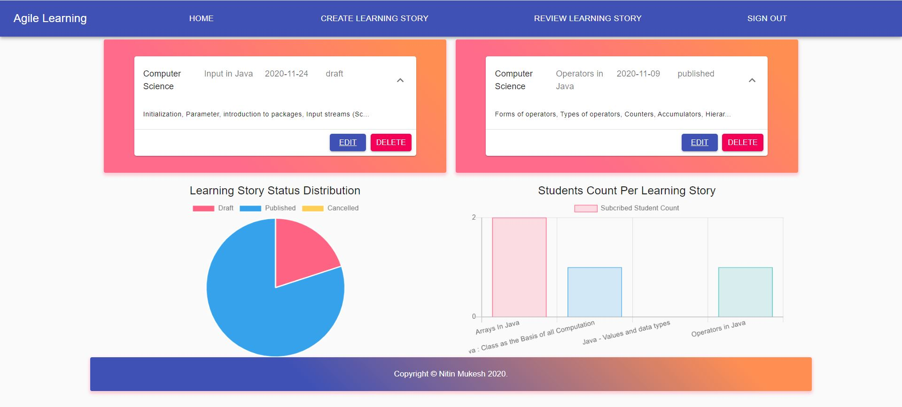
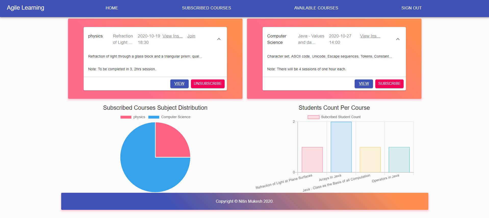

# Agile-Learning

## Description
An online platform for students to find and subscribe interactive learning courses. Student can subscribe for specific topics where they need assistance rather than one long course. 
It is built to promote agile way of learning where goal should be to create a learning story/course to teach stundents in a sprint of 2 weeks.
Also, avid instructors can sign up to publish short courses for students and track those courses. It is built on MERN stack (Mongo, Express, React, Node).

Find the application live on Heroku [here](https://agile-learning.herokuapp.com/).

## Table of Contents
* [Installation](#installation)
* [Usage](#usage)
* [Tests](#tests)
* [Technologies](#technologies)
* [Contributing](#contributing)
* [Screenshots](#screenshots)
* [URL](#url)
* [License](#license)
* [Questions](#questions)

## Installation
Please clone/fork repository and run npm install, configure mongo DB client to persist data, configure jwt secret token and execute "npm start".

## Usage
Create account with agile learning either as student or instructor and explore following possibilities:
* create a short learning course/story to teach online.
* track count of students and your courses.
* subscribe course specific to topic you want to learn.
* track your subscribed courses.
* unsubscribe from courses if you don't like them.

## Tests
No testing has been implemented for this application.

## Technologies
* Mongo, Express, React, Node
* Material-ui core, icons, lab
* luxon
* Passport
* jsonwebtoken
* react-chartjs-2
* react-router-dom
* dotenv

## Contributing
Contributions are welcome. Feel free to fork the project and create a pull request with your changes - be sure to document your code clearly.

## Screenshots

## URL
https://agile-learning.herokuapp.com/

## License
This application is covered by [MIT](./LICENSE) license

## Questions
* Please raise a request at [github](https://github.com/nitinmuk)
* For any private question/enquiry, please reach out to my email: nitinmukes@gmail.com

